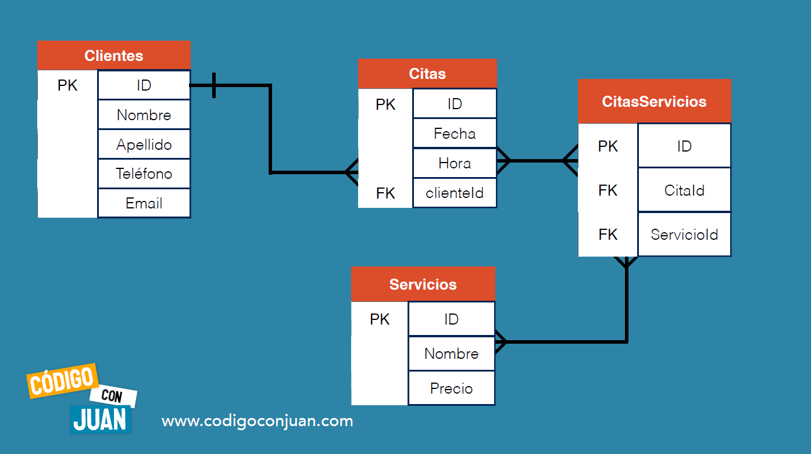

# SQL
**¿Qué es CRUD?**
* Create
* Read
* Update
* Delete
  
Son las cuatro operaciones que debe tener una aplicación. 
## Tipos de Datos 


## -> Comandos usados.
Muestra las bases de datos que tienes.
``` sql
    SHOW DATABASES;
```
Utiliza la base de datos appsalon.    
``` sql
USE appsalon;
```
Crea una tabla en la base de datos.
``` sql
CREATE TABLE servicios (
    -> id INT(11) NOT NULL AUTO_INCREMENT,
    -> nombre VARCHAR(60) NOT NULL,
    -> precio DECIMAL(6,2) NOT NULL,
    -> PRIMARY KEY (id)
    -> );
```
Crea otra tabla en la base de datos.
``` sql
create table reservaciones (
    -> id int(11) not null auto_increment,
    -> nombre varchar(60) not null,
    -> apellido varchar(60) not null,
    -> hora time default null,
    -> fecha date default null,
    -> servicios varchar(255) not null,
    -> primary key (id)
    -> );
```
Muestra los campos de la tabla y sus tipos de datos.
``` sql
DESCRIBE servicios;
```
Inserta datos dentro de la tabla.
 ``` sql
INSERT INTO servicios (nombre, precio) VALUES ('Corte de Cabello Dama', 90);
```

Inserta dos datos dentro de la tabla.
``` sql
INSERT INTO servicios (nombre, precio) VALUES
    -> ('Peinado Mujer',80),
    -> ('Peinado Hombre',70);
```
Visualizar todos los datos de la tabla.
``` sql
SELECT * FROM servicios;
```
Visualizar solo la columna nombre de la tabla.
``` sql
SELECT nombre FROM servicios;
```
Visualizar dos columnas nombre y precio de la tabla.
``` sql
SELECT nombre, precio FROM servicios;
```
Ordenar los datos por el precio. Puede ser ascendente (asc) ó descendente (desc). 
``` sql
SELECT id, nombre, precio FROM servicios ORDER BY precio;
```

Visualizar solo los primeros dos datos
``` sql
SELECT id, nombre, precio FROM servicios LIMIT 2;
```
Actualizar datos
``` sql
UPDATE servicios SET precio = 70 WHERE id = 2;
```
Eliminar una fila.
``` sql
delete from servicios where id = 1;
```
Agrega una nueva columna.
``` sql
alter table servicios add descripcion varchar(100) not null;
```
Cambiar el nombre de la nueva columna.
``` sql
alter table servicios change descripcion nuevonombre varchar(11) not null;
```
Eliminar columna
``` sql
alter table servicios drop column descripcion;
```
Eliminar tabla de base de datos.
``` sql
drop table servicios;
```

Visualizar de una tabla los valores que sera mayor ó igual a 80.
``` sql
select * from servicios where precio >= 80;
```
Visualizar de una tabla los valores entre dos cantidades.
``` sql
select * from servicios where precio between 100 and 200;
```
Visualizar de una tabla los valores entre dos cantidades.
``` sql
select * from servicios where precio between 100 and 200;
```

## -> Funciones Agregadoras.

Conocer cuantas reservaciones se tienen en cierto día.
``` sql
select count(id), fecha
    -> from reservaciones
    -> group by fecha
    -> order by count(id) desc;
```

Crea una columna temporal llamada totalServicios para conocer la sumatoria de todos los precios 
``` sql
select sum(precio) as totalServicios from servicios;
```

Conoce el valor mínimo de la columna precio 
``` sql
select min(precio) as precioMenor from servicios;
```

Conoce el valor máximo de la columna precio 
``` sql
select max(precio) as precioMayor from servicios;
```

## -> Cómo buscar en SQL. 
Para buscar en una tabla un dato: 

La busqueda **inicia** con la palabra 'Corte':
``` sql
select * from servicios where nombre like 'Corte%';
```

La busqueda **finaliza** con la palabra 'Cabello':
``` sql
select * from servicios where nombre like '%Cabello';
```

La busqueda **contiene en algun lugar** la palabra 'cabello':
``` sql
select * from servicios where nombre like '%Cabello%';
```

Para **concatenar** dos columnas de la tabla:
``` sql
select concat(nombre, ' ', apellido) as NombreCompleto from reservaciones;
```

Una busqueda por nombre y apellido concatenando ambas columnas en la tabla:
``` sql
select * from reservaciones where concat(nombre, ' ', apellido) like '%Ana Preciado%';
```
Una busqueda mostrando hora y fecha concatenando nombre y apellido: 
``` sql
select hora, fecha, concat(nombre, ' ', apellido) as 'nombre Completo'
    -> from reservaciones
    -> where concat(nombre, ' ', apellido)
    -> like '%ana preciado%';
```
Si queres hacer 2 consultas en una sola busqueda **"WHERE ID = ?"** solo acepta que coloques un solo ID. Entonces para hacer dos consultas se le hace: 

``` sql
select * from reservaciones where id in(1,3);
```
Esto te dará dos filas con en id 1 y el 3. 

Si quieres buscar una consulta por dos condiciones se hace de la siguiente manera:
``` sql
 select * from reservaciones where fecha = "2021-06-28" and concat(nombre, ' ', apellido) like '%ana preciado%';
```
y obtendras por fecha y por nombre.
Puedes usar el operador **and** varias veces .

## -> NORMALIZACIÓN DE BASE DE DATOS.
Es optimizar tú base de datos en base a ciertas reglas. Existen 5 reglas pero las 3 principales son las más importantes.

ESTO SE DEBE HACER EN TODAS LAS BASES DE DATOS.
* 1NF
  * Cada columna deve tenr solo 1 valor y no debe haber grupos(columnas) repetidos.

* 2NF (se enfoca en como se relacionan las columnas, en especial en la llave compuesta)
  * Una vez aplicada la primer regla, pasamos a la segunda.
  * Se utiliza en  **Llaves primarias compuestas**.
* 3NF(se enfoca en los demás datos que no forman parte de la llave compuesta)


PK -> Primary Key (llave primaria)
FK -> Foreign key (llave foranea). Debe tener el mismo tipo de dato que PK.

## -> DESNORMALIZACIÓN. 
En veces te encontrarás bases de datos que rompen las reglas de la normalización, no por eso significa que está mal.

Si el proyecto es muy sencillo puedes usar la desnormalización. Se recomienda usar la normalización pero debes evaluar que es lo mejor para tú proyecto. Si te toma 4min una y normalizarlo te tomará 30min y no va a ser algo complejo puedes no seguir las recomendaciones. Igual si es un proyecto de bajo presupuesto, etc. 


## -> DIAGRAMA ER (DE ENTIDAD RELACIÓN).
* Te darán una idea de forma gráfica de las entidades (tablas) y sus atributos.
* Ayudan a conocer cómo se relacionan los datos. 

### Cardinalidad
Numero máximo de veces que una **instancia**(tabla) se relaciona con otra. 
Numero máximo de vecese que 2 tablas se relacionan.


instancia: una tabla con otra.

1 a 1: un usuario puede solo tener un perfil. 


## COMANDOS PARA UNIR TABLAS JUNTO CON TABLA PIVOTE.


Para crear tabla de clientes:
``` sql
 create table clientes (
    -> id int(11) not null auto_increment,
    -> nombre varchar(60) not null,
    -> apellido varchar(60) not null,
    -> telefono varchar(10) not null,
    -> email varchar(30) not null unique,
    -> primary key (id)
    -> );
```

Para crear tabla de citas con **foreign key**:
``` sql
create table citas (
    -> id int(11) not null auto_increment,
    -> fecha date not null,
    -> hora time not null,
    -> clienteID int(11) not null,
    -> primary key (id),
    //nota desde aqui como colocar el foreign key
    -> key clienteId (clienteId),
    -> constraint cliente_FK
    -> foreign key (clienteId)
    -> references clientes (id)
    -> );
```
Para juntar dos tablas que contienen el mismo id:
``` sql
select * from citas
    -> inner join clientes on clientes.id = citas.clienteId;
```

Crear tabla pivote citasServicios con varios **foreign key**:
``` sql
CREATE table citasServicios (
    -> id int(11) auto_increment,
    -> citaId int(11) not null,
    -> servicioId int(11) not null,
    -> primary key (id),

    //nota: referencia a una trabla

    -> key citaId (citaId),
    -> constraint citas_fk
    -> foreign key (citaId)
    -> references citas (id),

    //nota: referencia a otra tabla

    -> key servicioId (servicioId),
    -> constraint servicios_FK
    -> foreign key (servicioId)
    -> references servicios (id)
    -> );
```
**NOTA: Recuerda que el mismo tipo de dato lo tienes que tener tanto en la tabla inicial cómo en la tabla de destino. Si es varchar(60), tiene que ser en la otra varchar(60); si es int(11), en la otra tiene que ser int(11).**

Ahora, para insertar datos dentro de esta tabla pivote:
``` sql
 insert into citasServicios (citaid, servicioid) values (1, 8);
```
Los values son los id de la cita y del servicio.

Para unir los valores de la tabla pivote, con la tabla citas, y la tabla servicios.
``` sql
 select * from citasServicios
    -> inner join citas on citas.id = citasservicios.citaId
    -> inner join servicios on servicios.id = citasSErvicios.servicioId;
```

Puedes unir tantas tablas cómo requieras: 
``` sql
  select * from citasServicios
    -> inner join citas on citas.id = citasservicios.citaId
    -> inner join servicios on servicios.id = citasservicios.servicioId
    -> inner join clientes on citas.clienteId = clientes.id;
```
Aquí estamos uniendo todas las tablas.